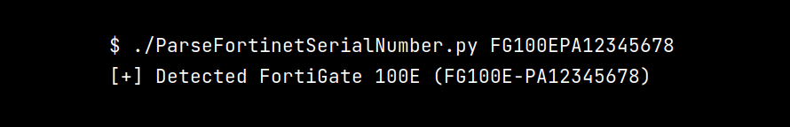
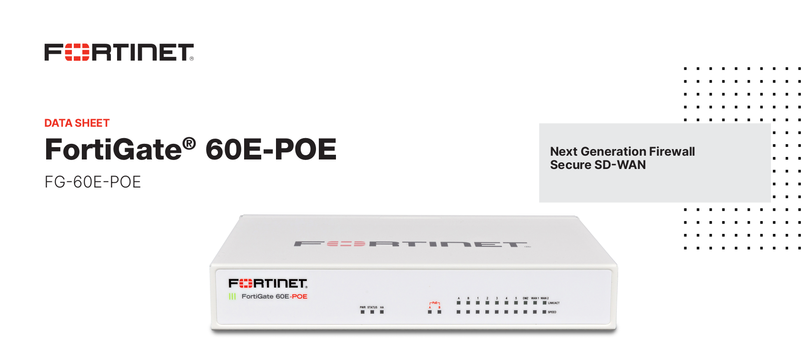
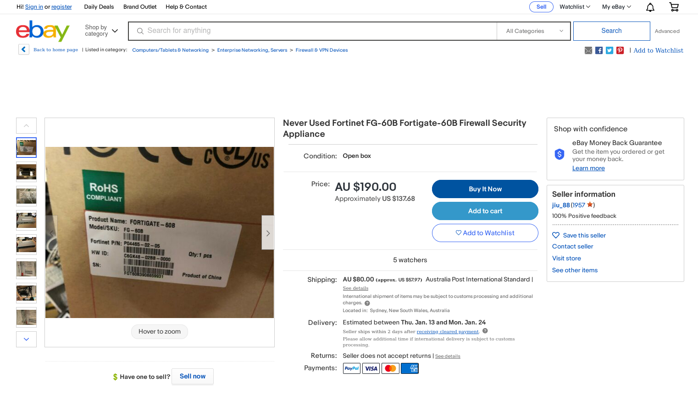

# ParseFortinetSerialNumber

A Python script to parse Fortinet products serial numbers, and detect the associated model and version.



## Example

```
$ ./ParseFortinetSerialNumber.py FG100EPA12345678
[+] Detected FortiGate 100E (FG100E-PA12345678)
```

## Source of information

There is two main sources of information:

### The docs

In Fortinet products datasheets (available in [./docs/](./docs/)), we can see what the device looks like and its technical characteristics. 



### Ebay

Another great source of information is [ebay.com](https://www.ebay.com/). This is very useful to find serial number photos and know the serial number pattern for the given model: 



You can find many of the photos extracted from ebay in [./photos/](./photos/).

## Contributing

Feel free to open a pull requests if you want to add other serial numbers, documentations or screenshots we don't have yet.
